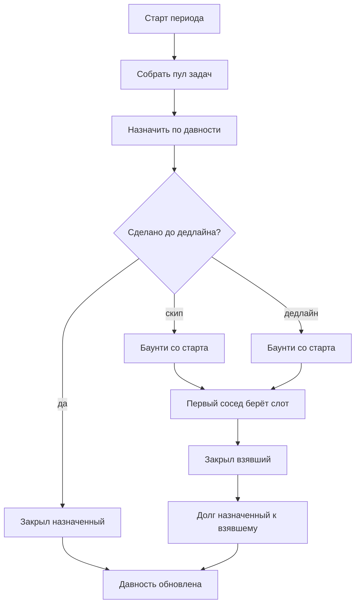

# Спека: инструмент ротации быта с баунти

Домашка. Пока только спецификация, без кода.

Одной фразой: общий график дежурств по правилу «давно не делал — твоя»; единственный клапан — баунти с фиксированным стартом, которое каждый день на доске дорожает на заданный процент.

## Что это

Приложение для квартиры на **N ≥ 3** жильцов.

Раз в период (по умолчанию календарная неделя) собирается пул повторяющихся задач. Система сама вешает каждую задачу на того, кто дольше всех не закрывал именно её.

Сделал вовремя — денег нет. Не хочешь или просрочил — слот выходит на доску как баунти. Первый согласившийся сосед забирает его и получает деньги с назначенного.

Это обычный учёт общих дел. Странность одна: неудобный слот можно сбросить деньгами. Аукциона нет. Свою цену задать нельзя.

## Правило назначения

- У каждой задачи хранится `last_done_at` по каждому жильцу: кто когда её закрывал.
- На старте периода свободный слот достаётся жильцу с самым старым `last_done_at` по этой задаче.
- Пустая история = дата вступления в квартиру, чтобы новичок не забирал весь пул.
- Закрывает слот тот, кто фактически сделал: назначенный или взявший баунти.
- Давность обновляется у того, кто сделал, не у того, кто откупился.

## Скип, просрочка, баунти

У каждой задачи в каталоге есть фиксированный старт. Свою цену задать нельзя.

Два входа на одну доску:

- **Скип** до дедлайна: слот выходит как баунти со старта.
- **Просрочка:** если баунти ещё не было, слот сам выходит со старта.

Дальше одно правило. Каждый день, пока никто не взял, сумма растёт на заданный процент. Ставка одна на квартиру:

```
к_оплате = старт × (1 + дневная_ставка × дни_на_доске)
```

В день выхода `дни_на_доске = 0`, выплата = старт.

Часы роста — дни с выхода на доску (скип или авто с дедлайна), не с понедельника.

Кто может:

- Взять баунти могут все жильцы кроме текущего назначенного.
- Берёт первый, кто согласился по текущей цене. Торговли нет.
- Деньги идут взявшему, не в общую банку.
- В приложении это долг / IOU. Перевод снаружи.

Если никто не взял: слот висит, сумма растёт, ответственность остаётся на назначенном, пока кто-то не заберёт.

## Поток периода



## Статусы слота

- назначен
- скипнут
- просрочен
- баунти
- сделан

Скип и просрочка оба приводят на доску баунти. Разница только в том, кто вывел слот: человек или дедлайн.

## Края

- **Новичок.** Нет истории по задачам → `last_done_at` = дата вступления. Не считается, что он «никогда не делал», иначе заберёт весь пул.
- **Никто не взял баунти.** Слот остаётся на назначенном, сумма растёт каждый день.
- **Выход жильца.** Открытые долги остаются. Незакрытые слоты возвращаются в пул и переназначаются.
- **Одинаковая давность.** Если у двоих одно и то же `last_done_at`, берём того, кто раньше вступил в квартиру. Если и это одинаково — по стабильному id жильца.
- **Несколько слотов на одном человеке.** Каждый скип/просрочка независим.
- **Назначенный не берёт своё баунти.** Нельзя откупиться самому у себя.

## Входит в v1

- Квартира, жильцы, каталог повторяющихся задач: название, период (каждая неделя / раз в 2 недели), старт награды.
- Генерация пула на период и автоназначение по давности.
- Статусы слота.
- Баунти: фикс-старт, ежедневный процент, пока висит.
- Журнал долгов: кто кому сколько должен по закрытым баунти.
- Отметка «сделано» текущим держателем слота. Без фото и без подтверждения соседа.

## Не входит

- Обратный аукцион, ставки, торг «кто дешевле».
- Своя стартовая цена баунти.
- Реальные платежи, эквайринг, игровая валюта.
- Баллы, лиги, XP, бейджи.
- Суд, профсоюз, конституция квартиры.
- Мобильные клиенты, пуши, чат.
- Разовые задачи вне каталога — можно во v2.

## Умолчания

- Период = календарная неделя.
- Дедлайн слота = конец периода.
- Дневная ставка процента задаётся в настройках квартиры.
- Процент простой, не сложный: линейно от старта и числа дней на доске.
- Деньги в приложении только как IOU.
